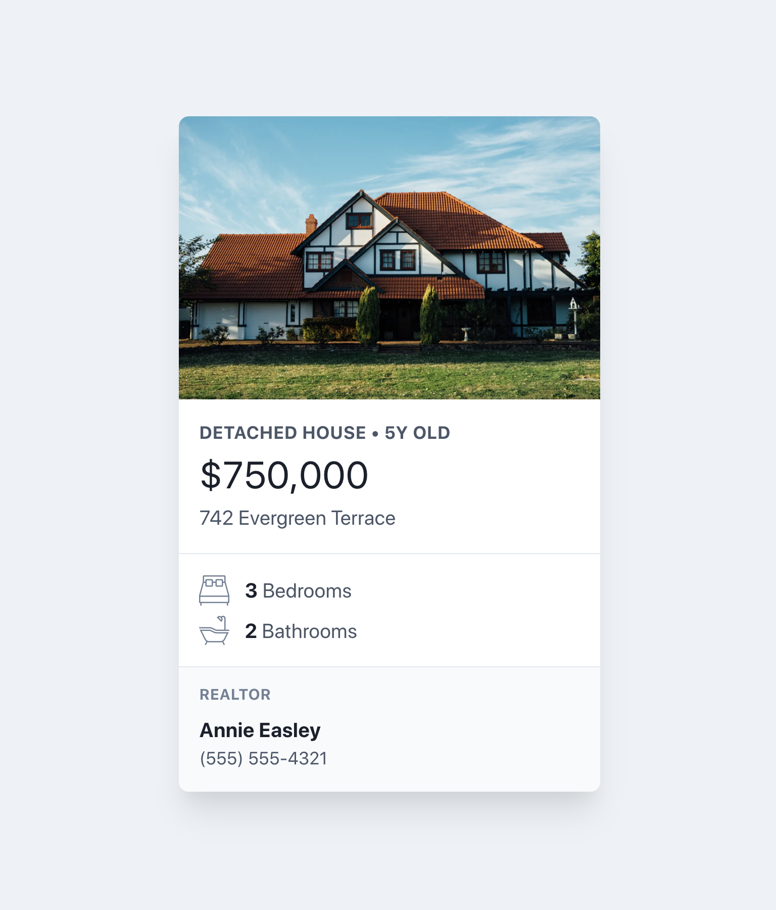

# Lab: Property card

1. *Fork* the repository, then *clone* the new repository to your local computer.
2. Take the sample composition below and annotate the elements and layers using the graphic software of your choice. Consider the visual representation of each later or component, while also noting the element type and providing an appropriate class name (or classes) for each, at minimum
3. Recreate the card using semantic HTML and CSS, using the techniques learned to this point about information architecture, design systems, and best practices in HTML/CSS.
4. Consider where a button that says "Learn more" would be placed. Design and code it to link to the current page, but imagine it would be used to link to the full property listing.

## Sample composition

